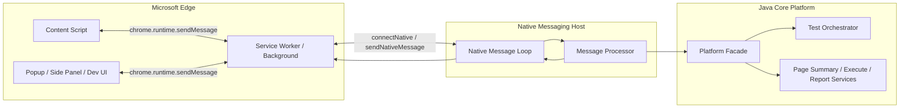
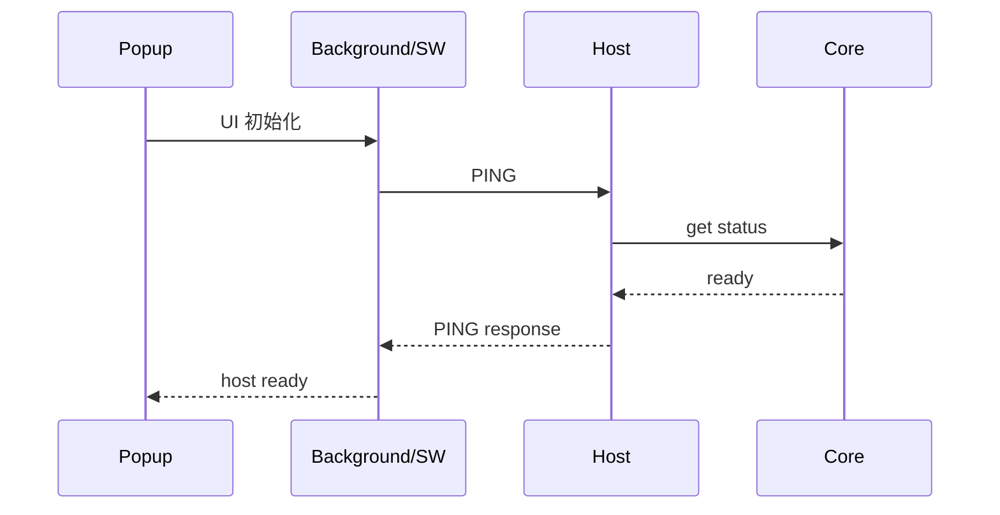
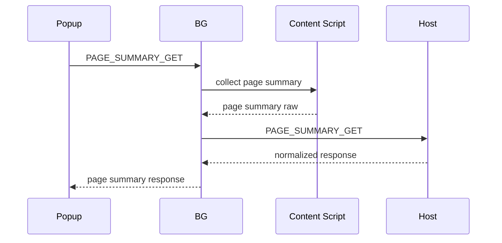
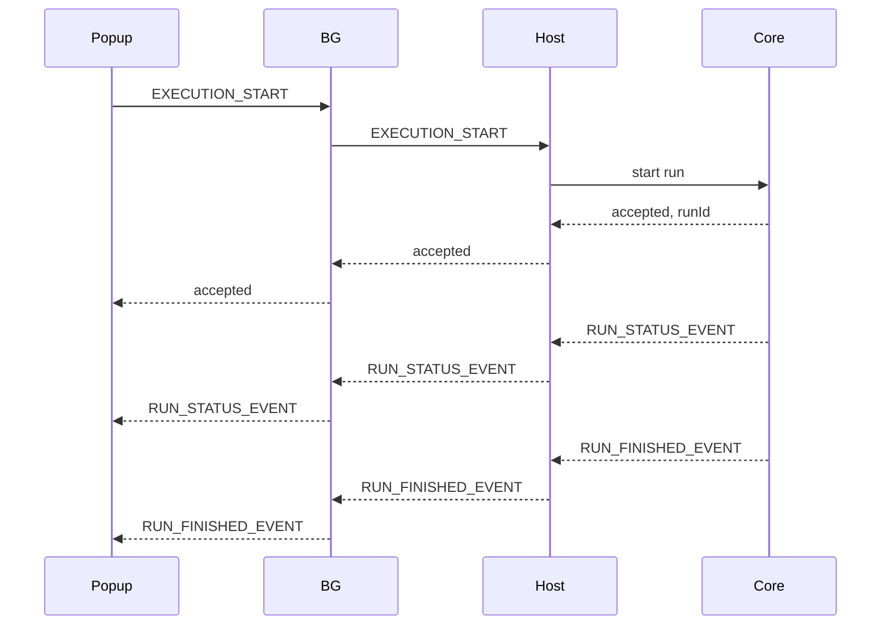

# Edge 插件 + Native Messaging 通信协议详细文档
**版本**: v1.0  
**定位**: 企业级网页自动化测试平台中，**Edge 扩展** 与 **Java Native Messaging Host / 本地核心平台** 的通信协议、时序、错误码、安全边界与实现约定文档  
**适用范围**: Microsoft Edge（Chromium） + Manifest V3 + Native Messaging Host（stdio）  
**前置文档**:  
- `enterprise_web_test_platform_tech_design.md`  
- `enterprise_web_test_platform_phase2_implementation_design.md`  
- `enterprise_web_test_platform_phase3_java_core_code_skeleton.md`  
- `cdp_domain_encapsulation_detailed_design.md`

---

# 目录

1. 文档目标  
2. 官方能力边界与约束  
3. 本平台中的角色划分  
4. 总体通信架构  
5. 协议设计原则  
6. Native Messaging 基础协议  
7. 应用层消息协议  
8. 消息类型定义  
9. 典型时序图  
10. Edge 插件端设计  
11. Native Host 端设计  
12. 与 Java 核心平台的集成方式  
13. 安全模型  
14. 错误码设计  
15. 安装与注册约定  
16. 开发环境与生产环境差异  
17. 日志、审计与故障排查  
18. 代码结构建议  
19. 首批最小实现建议  
20. 常见坑与规避策略  
21. 官方参考资料  

---

# 1. 文档目标

这份文档解决以下问题：

- Edge 扩展如何与本地 Java 程序通信
- Native Messaging 的底层协议长什么样
- 我们自己的应用层 JSON 协议如何设计
- 请求、响应、事件、错误怎么统一
- 扩展端和 Host 端分别负责什么
- 安全、权限、审计如何做
- 首批应该先实现哪些消息类型

目标是让前后两端开发可以**直接按协议对接**。

---

# 2. 官方能力边界与约束

Microsoft Edge 的 Native Messaging 文档说明：

- 扩展通过类似消息传递 API 的方式与本地 Win32 应用通信。  
- 扩展端需要在 `manifest.json` 中声明 `nativeMessaging` 权限。  
- Native Host manifest 必须声明：
  - `name`
  - `description`
  - `path`
  - `type: "stdio"`
  - `allowed_origins`  
- Edge 启动 Host 后，双方通过 `stdin/stdout` 通信。  
- 消息格式是：
  - JSON
  - UTF-8 编码
  - 前置 **32 位消息长度**，使用 **native byte order**。  
- 从 Host 发给 Edge 的单条消息最大为 **1 MB**。  
- 发给 Host 的单条消息最大为 **4 GB**。  
- 第一个命令行参数是调用方 origin，通常是 `chrome-extension://<extension-id>`。  
- Windows 下还会传入 `--parent-window=<decimal handle>`，如果调用方是 service worker，这个值可能为 0。  
参考：  
- https://learn.microsoft.com/en-us/microsoft-edge/extensions/developer-guide/native-messaging citeturn614508view0

另外，Edge 扩展支持 Manifest V3，Chrome 扩展迁移到 Edge 的代码通常大体兼容。 citeturn614508view1turn614508view2

---

# 3. 本平台中的角色划分

## 3.1 角色总览

本平台中有四个关键角色：

### A. Edge Extension
浏览器扩展层，负责：
- 页面观察
- 元素选择辅助
- 页面可见文本采集
- 当前 tab 摘要
- 与本地 Host 通信

### B. Native Messaging Host
本地桥接进程，负责：
- 接收扩展消息
- 校验来源
- 分发给 Java 核心平台
- 返回结果
- 维持桥接生命周期

### C. Java Core Platform
本地核心执行平台，负责：
- 测试流程执行
- CDP 浏览器控制
- DSL 解析
- 断言
- 截图/报告
- Agent
- DB 校验

### D. Edge Browser Page Context
具体网页上下文，负责：
- content script 注入执行
- 页面 DOM / 文本 / 表单结构采集
- 页面内高亮辅助

---

# 4. 总体通信架构

## 4.1 总体架构图



---

## 4.2 为什么要通过 Service Worker 中转

在 Manifest V3 下，推荐由 background/service worker 统一负责：
- Native Port 生命周期
- 扩展内消息总线
- 请求/响应关联
- 重连
- 错误归并

而不是让 content script 直接到处管理 native port。

---

# 5. 协议设计原则

## 5.1 分层设计

### 第一层：Native Messaging 传输层
由 Edge 规定：
- 4 字节长度头
- UTF-8 JSON
- stdin/stdout

### 第二层：应用层消息协议
由我们定义：
- 消息包结构
- type
- requestId
- payload
- error
- traceId

## 5.2 明确三类消息
- Request：请求
- Response：响应
- Event：事件/通知

## 5.3 必须可追踪
每条业务消息都要有：
- `requestId`
- `timestamp`
- `source`
- `traceId`（推荐）

## 5.4 扩展端不能直接暴露复杂内部能力
扩展不是“万能控制器”，而是受控前端。  
真正高权限能力（执行测试、读配置、DB 断言、文件落地）必须在 Host / Java Core 完成。

---

# 6. Native Messaging 基础协议

## 6.1 底层消息格式

每条消息的二进制格式：

```text
[4-byte message length in native byte order][UTF-8 JSON bytes]
```

例如：

```text
length = 123
payload = {"type":"PING","requestId":"req-001","payload":{}}
```

## 6.2 长度字段说明

- 32-bit unsigned / native byte order
- Windows/常见平台一般按 little-endian 处理
- Host 端必须先读 4 字节，再读取对应长度 JSON

## 6.3 Host -> Edge 消息大小限制
单条最大 **1 MB**。  
因此：
- 不要直接通过 Native Messaging 传超大 DOM 全量
- 不要直接传大截图二进制
- 大对象应改为：
  - 本地落盘
  - 只回传摘要 / 路径 / 引用 ID

## 6.4 建议传输策略
### 可以直接传
- 页面摘要
- 可见文本摘要
- 元素定位候选
- 状态信息
- 轻量执行结果
- 报告路径
- 错误信息

### 不建议直接传
- 全页面完整 HTML（大页面）
- 全量截图 base64
- 全量网络 body 列表
- 大型调试日志

---

# 7. 应用层消息协议

## 7.1 统一消息包格式

```json
{
  "version": "1.0",
  "kind": "request",
  "type": "PAGE_SUMMARY_GET",
  "requestId": "req_20260415_001",
  "traceId": "trace_abc123",
  "timestamp": 1776200000000,
  "source": {
    "side": "extension",
    "module": "background",
    "extensionId": "abcdefghijklmnopabcdefghijklmnop",
    "tabId": 123,
    "frameId": 0
  },
  "payload": {}
}
```

---

## 7.2 顶层字段定义

### `version`
协议版本。  
建议初始固定为 `"1.0"`。

### `kind`
消息种类：
- `request`
- `response`
- `event`

### `type`
业务消息类型，例如：
- `PING`
- `PAGE_SUMMARY_GET`
- `EXECUTION_START`
- `RUN_STATUS_EVENT`

### `requestId`
请求唯一 ID。  
`response` 必须回填同一个 `requestId`。

### `traceId`
整条链路追踪 ID。  
建议跨：
- extension
- host
- java core
统一传递。

### `timestamp`
消息发送时间戳（毫秒）。

### `source`
来源元信息。

### `payload`
业务数据体。

### `error`
仅在失败响应中使用。

---

## 7.3 响应消息格式

```json
{
  "version": "1.0",
  "kind": "response",
  "type": "PAGE_SUMMARY_GET",
  "requestId": "req_20260415_001",
  "traceId": "trace_abc123",
  "timestamp": 1776200000100,
  "source": {
    "side": "host",
    "module": "native-host"
  },
  "success": true,
  "payload": {
    "url": "https://example.com/login",
    "title": "登录页",
    "visibleText": "用户名 密码 登录",
    "forms": []
  }
}
```

---

## 7.4 失败响应格式

```json
{
  "version": "1.0",
  "kind": "response",
  "type": "PAGE_SUMMARY_GET",
  "requestId": "req_20260415_001",
  "traceId": "trace_abc123",
  "timestamp": 1776200000100,
  "source": {
    "side": "host",
    "module": "native-host"
  },
  "success": false,
  "error": {
    "code": "PAGE_CONTEXT_UNAVAILABLE",
    "message": "Current tab does not have an active content script context",
    "details": null,
    "retryable": true
  }
}
```

---

## 7.5 事件消息格式

```json
{
  "version": "1.0",
  "kind": "event",
  "type": "RUN_STATUS_EVENT",
  "requestId": "req_20260415_exec_001",
  "traceId": "trace_run_001",
  "timestamp": 1776200000200,
  "source": {
    "side": "host",
    "module": "java-core"
  },
  "payload": {
    "runId": "run_001",
    "status": "RUNNING",
    "currentStep": "step_003",
    "message": "正在点击登录按钮"
  }
}
```

---

# 8. 消息类型定义

下面给出建议的首批消息类型。

---

## 8.1 基础链路类

### `PING`
用途：
- 连接性检测
- 版本探测
- Host 是否可用

Request payload:
```json
{}
```

Response payload:
```json
{
  "hostVersion": "1.0.0",
  "protocolVersion": "1.0",
  "platformReady": true
}
```

---

### `GET_HOST_INFO`
用途：
- 获取 Host 基础信息
- 安装状态
- Java Core 状态
- 版本信息

Response payload:
```json
{
  "hostVersion": "1.0.0",
  "coreVersion": "1.0.0",
  "os": "Windows",
  "javaVersion": "21",
  "extensionOriginVerified": true
}
```

---

## 8.2 页面采集类

### `PAGE_SUMMARY_GET`
用途：
- 获取当前页面摘要
- 获取 URL、title、可见文本、表单字段摘要

Request payload:
```json
{
  "includeVisibleText": true,
  "includeForms": true,
  "includeButtons": true
}
```

Response payload:
```json
{
  "url": "https://example.com/login",
  "title": "登录页",
  "visibleText": "用户名 密码 登录",
  "forms": [
    {
      "name": "loginForm",
      "fields": [
        { "label": "用户名", "type": "text" },
        { "label": "密码", "type": "password" }
      ]
    }
  ],
  "buttons": [
    { "text": "登录", "role": "button" }
  ]
}
```

---

### `PAGE_LOCATOR_CANDIDATES_GET`
用途：
- 对用户当前选中的元素生成候选定位器

Request payload:
```json
{
  "elementRef": {
    "cssPath": "#loginBtn"
  }
}
```

Response payload:
```json
{
  "candidates": [
    { "by": "id", "value": "loginBtn", "score": 0.95 },
    { "by": "text", "value": "登录", "score": 0.80 },
    { "by": "css", "value": "#loginBtn", "score": 0.70 }
  ]
}
```

---

### `PAGE_VISIBLE_TEXT_GET`
用途：
- 获取当前页面可见文本摘要

---

### `PAGE_HIGHLIGHT`
用途：
- 让 content script 高亮某个元素
- 用于调试与元素选取辅助

Request payload:
```json
{
  "locator": {
    "by": "css",
    "value": "#loginBtn"
  }
}
```

---

## 8.3 执行控制类

### `EXECUTION_START`
用途：
- 请求 Java Core 按 DSL / caseId 执行测试

Request payload:
```json
{
  "mode": "caseId",
  "caseId": "case_login_error_001",
  "env": "sit"
}
```

或者：

```json
{
  "mode": "inlineDsl",
  "dsl": {
    "id": "case_login_error_001",
    "steps": []
  },
  "env": "sit"
}
```

Response payload:
```json
{
  "runId": "run_001",
  "accepted": true
}
```

---

### `EXECUTION_STOP`
用途：
- 终止指定 run

Request payload:
```json
{
  "runId": "run_001"
}
```

---

### `EXECUTION_STATUS_GET`
用途：
- 查询执行状态

Response payload:
```json
{
  "runId": "run_001",
  "status": "RUNNING",
  "currentStep": "step_003",
  "progress": 0.6
}
```

---

### `RUN_STATUS_EVENT`
用途：
- Host/Java Core 主动向扩展推送运行状态事件

事件 payload:
```json
{
  "runId": "run_001",
  "status": "RUNNING",
  "currentStep": "step_003",
  "message": "等待错误提示出现"
}
```

---

### `RUN_FINISHED_EVENT`
用途：
- 运行完成后推送

事件 payload:
```json
{
  "runId": "run_001",
  "status": "FAILED",
  "reportPath": "C:\\app\\runs\\run_001\\report.html"
}
```

---

## 8.4 报告与结果类

### `REPORT_PATH_GET`
用途：
- 获取报告文件路径
- 或获取本地管理页面可访问 URL

Response payload:
```json
{
  "runId": "run_001",
  "reportPath": "C:\\app\\runs\\run_001\\report.html"
}
```

---

### `RUN_ARTIFACTS_GET`
用途：
- 获取截图、DOM、console、network 的索引摘要

---

## 8.5 配置与环境类

### `ENVIRONMENTS_GET`
用途：
- 获取可用环境列表

### `DATASOURCES_GET`
用途：
- 获取可用数据源列表（只返回安全摘要）

### `SETTINGS_GET`
用途：
- 获取平台配置摘要

---

## 8.6 Agent 辅助类

### `AGENT_CASE_GENERATE`
用途：
- 自然语言生成测试 DSL

### `AGENT_FAILURE_ANALYZE`
用途：
- 基于失败摘要生成分析建议

这类消息建议第二阶段再接入。

---

# 9. 典型时序图

## 9.1 扩展启动后探测 Host



---

## 9.2 获取页面摘要



说明：
- 页面 DOM / 可见文本采集在 content script 完成
- Host 只做统一协议归一化和平台级校验
- 是否完全经 Host 中转取决于你的实现策略  
  但为了统一审计和调试，建议最终都通过 BG -> Host -> BG 返回

---

## 9.3 启动执行



---

# 10. Edge 插件端设计

## 10.1 模块划分

### Background / Service Worker
职责：
- Native Port 建立与维护
- 请求/响应关联
- 事件转发
- 内容脚本通信
- 心跳与重连
- 统一错误处理

### Content Script
职责：
- 页面摘要采集
- DOM / 可见文本 / 表单字段提取
- 元素高亮
- 元素定位候选辅助

### Popup / Side Panel / Dev UI
职责：
- 展示 Host 状态
- 展示页面摘要
- 触发执行
- 接收运行状态事件

---

## 10.2 Native Port 管理建议

建议在 Background 中维护单例 Native Port：

```ts
type NativeBridgeState = {
  port: chrome.runtime.Port | null;
  connected: boolean;
  lastHeartbeatAt?: number;
  pending: Map<string, PendingRequest>;
};
```

## 10.3 推荐 API 封装

```ts
async function sendNativeRequest<TReq, TRes>(
  type: string,
  payload: TReq
): Promise<TRes>
```

由内部自动：
- 生成 requestId
- 写入 pending map
- postMessage
- 超时清理
- 返回 Promise

## 10.4 扩展内消息总线建议
Background 对 Popup / Content Script 提供统一接口：
- `EXT_HOST_PING`
- `EXT_PAGE_SUMMARY_GET`
- `EXT_EXECUTION_START`

不要让 Popup 直接理解 Native Messaging 细节。

---

# 11. Native Host 端设计

## 11.1 Host 的角色
Host 是：
- 浏览器信任的本地桥
- Java Core 的前门
- 协议转换层
- 安全校验层
- 轻量消息路由层

不是：
- 完整业务平台
- 页面 DOM 处理器
- 重业务逻辑承载层

## 11.2 Host 核心模块

```text
native-host/
├─ NativeMessageLoop
├─ NativeMessageCodec
├─ NativeMessageProcessor
├─ OriginVerifier
├─ PlatformBridgeClient
└─ ErrorMapper
```

## 11.3 建议职责

### NativeMessageLoop
- 读 stdin
- 解码长度头
- 读 JSON
- 分发 processor
- 编码 response
- 写 stdout

### OriginVerifier
- 校验启动参数 origin
- 与 allowlist / 配置比对
- 输出审计日志

### PlatformBridgeClient
- 调用 Java Core Platform
- 可以是：
  - 直接同进程调用
  - 本地 HTTP
  - 本地 IPC

### ErrorMapper
- 把 Java 异常映射为协议 error

---

# 12. 与 Java 核心平台的集成方式

## 12.1 三种可选方案

### 方案 A：Host 与 Core 同进程
优点：
- 最简单
- 少一层 IPC
- 开发效率高

缺点：
- Host 与 Core 生命周期耦合
- 一旦 Core 出错可能影响 Host 稳定性

### 方案 B：Host 为薄桥，Core 为本地 HTTP 服务
优点：
- 解耦
- Core 可单独启动与监控
- 便于桌面管理台复用

缺点：
- 多一层本地通信

### 方案 C：Host 与 Core 用本地 socket/命名管道
优点：
- 高性能
- 更原生

缺点：
- 实现更复杂

## 12.2 推荐结论
企业级建议：
**Host 薄桥 + Java Core 本地 HTTP/本地服务**
这样：
- 扩展只认 Host
- Host 只认本地 Core
- Core 负责全部业务

---

# 13. 安全模型

## 13.1 第一层：Edge 官方 allowlist
Host manifest 中必须配置 `allowed_origins`，只允许指定扩展连接。Edge 读取并校验 host manifest。 citeturn614508view0

## 13.2 第二层：运行时 origin 校验
Host 启动时会收到调用方 origin 参数。  
Host 必须再次校验：
- 是否在允许列表
- 是否与当前环境一致

## 13.3 第三层：请求级权限校验
即使扩展合法，也不代表所有消息都能放行。  
例如：
- `EXECUTION_START` 允许
- `DATASOURCE_RAW_QUERY` 不允许直接暴露给扩展

## 13.4 第四层：危险能力不经扩展直通
以下能力必须由 Core 受控：
- DB 断言
- 文件系统写入
- DSL 存储
- 报告读取
- 环境切换

## 13.5 敏感信息保护
协议层禁止直接返回：
- 数据库密码
- 环境 secret
- 原始 token
- 大块敏感 HTML / body

---

# 14. 错误码设计

## 14.1 通用错误码

- `BAD_REQUEST`
- `UNSUPPORTED_MESSAGE_TYPE`
- `TIMEOUT`
- `INTERNAL_ERROR`

## 14.2 扩展侧错误码

- `EXTENSION_CONTEXT_UNAVAILABLE`
- `CONTENT_SCRIPT_NOT_READY`
- `TAB_NOT_FOUND`
- `PAGE_CONTEXT_UNAVAILABLE`

## 14.3 Host 侧错误码

- `HOST_NOT_READY`
- `ORIGIN_NOT_ALLOWED`
- `INVALID_PROTOCOL_VERSION`
- `MESSAGE_TOO_LARGE`
- `HOST_IO_ERROR`

## 14.4 Core 侧错误码

- `PLATFORM_NOT_READY`
- `RUN_NOT_FOUND`
- `CASE_NOT_FOUND`
- `ENV_NOT_FOUND`
- `EXECUTION_REJECTED`
- `REPORT_NOT_FOUND`

## 14.5 错误结构建议

```json
{
  "code": "ORIGIN_NOT_ALLOWED",
  "message": "Extension origin is not allowed by host policy",
  "details": {
    "origin": "chrome-extension://xxxx/"
  },
  "retryable": false
}
```

---

# 15. 安装与注册约定

## 15.1 扩展端
- `manifest.json` 必须声明 `nativeMessaging` 权限。 citeturn614508view0

## 15.2 Host manifest
示例：

```json
{
  "name": "com.your_company.web_test_host",
  "description": "Enterprise Web Test Platform Host",
  "path": "C:\\Program Files\\YourCompany\\WebTest\\native-host.exe",
  "type": "stdio",
  "allowed_origins": [
    "chrome-extension://abcdefghijklmnopabcdefghijklmnop/"
  ]
}
```

字段要求、`type: "stdio"`、`allowed_origins` 和 name 约束由 Edge 官方定义。 citeturn614508view0

## 15.3 Windows 注册表
Edge 在 Windows 上通过注册表查找 host manifest 路径。  
优先查找 Edge 键，再查 Chromium/Chrome 回退位置。官方文档给出了 `HKCU` / `HKLM` 下的查找顺序与示例命令。 citeturn614508view0

## 15.4 开发与发布的 extension ID 差异
官方文档特别提醒：
- 侧载开发时的 extension ID
- 正式发布后的 extension ID  
可能不同。  
因此发布后若 ID 变化，必须更新 host manifest 里的 `allowed_origins`。 citeturn614508view0

---

# 16. 开发环境与生产环境差异

## 16.1 开发环境
- 扩展走 sideload
- `allowed_origins` 写开发 extension ID
- 可开调试日志
- Host 可以输出更详细 trace

## 16.2 生产环境
- 扩展走正式发布 ID
- Host 日志降噪
- 严格校验 origin
- 严格限制高权限消息类型
- 敏感字段脱敏
- 需要安装器自动注册 manifest / 注册表

---

# 17. 日志、审计与故障排查

## 17.1 每条消息建议记录
- timestamp
- requestId
- traceId
- direction（in/out）
- type
- success/failure
- durationMs
- source origin
- payload 摘要

## 17.2 不能直接记全量内容的情况
以下内容建议只记摘要：
- visibleText 超长
- DSL 全量
- HTML
- DB 查询结果
- report 内容

## 17.3 故障排查重点
- 扩展是否有 `nativeMessaging` 权限
- Host manifest 是否注册正确
- `allowed_origins` 是否匹配
- host 进程是否启动
- stdin/stdout 是否写了额外日志污染协议
- 消息是否超过大小限制
- requestId 是否正确关联
- service worker 是否被回收导致 port 丢失

---

# 18. 代码结构建议

## 18.1 Edge 扩展

```text
edge-extension/
├─ src/
│  ├─ background/
│  │  ├─ nativeBridge.ts
│  │  ├─ requestRouter.ts
│  │  └─ eventBus.ts
│  ├─ content/
│  │  ├─ pageSummary.ts
│  │  ├─ locatorCandidates.ts
│  │  └─ highlighter.ts
│  ├─ popup/
│  │  ├─ popup.tsx
│  │  └─ api.ts
│  └─ shared/
│     ├─ protocol.ts
│     ├─ messageTypes.ts
│     └─ errorCodes.ts
└─ manifest.json
```

## 18.2 Native Host

```text
native-host/
├─ protocol/
│  ├─ NativeEnvelope.java
│  ├─ NativeRequest.java
│  ├─ NativeResponse.java
│  └─ NativeError.java
├─ codec/
│  ├─ NativeMessageReader.java
│  ├─ NativeMessageWriter.java
│  └─ NativeMessageCodec.java
├─ processor/
│  ├─ NativeMessageProcessor.java
│  ├─ DefaultNativeMessageProcessor.java
│  └─ handlers/
│     ├─ PingHandler.java
│     ├─ PageSummaryHandler.java
│     ├─ ExecutionStartHandler.java
│     └─ ExecutionStatusHandler.java
├─ security/
│  └─ OriginVerifier.java
└─ app/
   └─ NativeHostApp.java
```

---

# 19. 首批最小实现建议

## 19.1 第一批必须打通的消息
- `PING`
- `GET_HOST_INFO`
- `PAGE_SUMMARY_GET`
- `EXECUTION_START`
- `EXECUTION_STATUS_GET`

## 19.2 第一批必须打通的扩展链路
- Popup -> Background
- Background -> Native Host
- Background -> Content Script
- 状态事件回推到 Popup

## 19.3 第一批 Host 端必须实现
- 长度头读写
- JSON 解析
- origin 校验
- 请求/响应处理
- 错误映射

## 19.4 第一批 Java Core 集成
- 提供一个本地 facade：
  - `ping()`
  - `getHostInfo()`
  - `startExecution()`
  - `getExecutionStatus()`

---

# 20. 常见坑与规避策略

## 20.1 Host stdout 不能乱打日志
Native Messaging 用 stdout 传协议消息。  
如果你把普通日志也打到 stdout，会直接破坏协议。  
**普通日志必须走 stderr 或文件。**

## 20.2 消息过大
不要把：
- 整页 HTML
- 大截图 base64
- 全量 network body  
直接经 Native Messaging 发回扩展。

## 20.3 service worker 生命周期
Manifest V3 下 service worker 会休眠/回收。  
所以：
- 要处理 port 重建
- 要处理 pending request 超时
- 不要假设后台常驻

## 20.4 只在 manifest 层校验不够
即使 `allowed_origins` 已限制，Host 启动后仍应再次校验 origin 参数。

## 20.5 开发与发布 extension ID 不同
发布后 host manifest 里的 `allowed_origins` 可能要更新。 citeturn614508view0

## 20.6 不要把业务复杂度塞给扩展
复杂执行逻辑、DB、Agent、报告都应在 Core 端。

---

# 21. 官方参考资料

Microsoft Edge 官方 Native Messaging 文档说明了权限、host manifest、注册表路径、消息格式、大小限制、origin 参数与 `--parent-window` 参数。 citeturn614508view0

Manifest V3 与扩展迁移相关信息可参考 Edge 官方文档。 citeturn614508view1turn614508view2

---

**文档结束**
