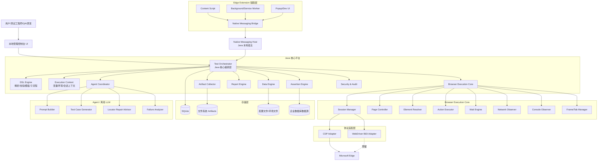
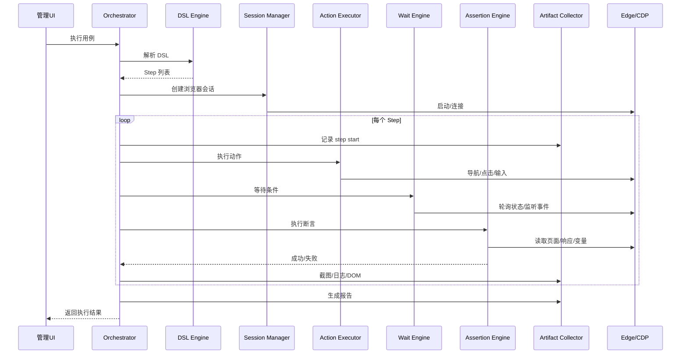

# 企业级网页自动化测试平台技术方案  
**版本**: v1.0  
**定位**: 基于 **Edge + CDP + Java 核心平台 + TypeScript 插件/UI + Agent/离线 LLM** 的企业级、本地可部署、可治理的网页自动化测试平台  
**文档目标**: 作为项目立项、架构设计、技术选型、研发拆分和后续交付的统一技术文档

---

# 目录

1. 项目背景与目标  
2. 建设原则  
3. 总体技术路线  
4. 总体架构图  
5. 架构分层详细设计  
6. 关键技术选型与理由  
7. 核心执行引擎设计  
8. DSL 设计  
9. 断言系统设计  
10. 观测与报告体系  
11. Agent / 离线 LLM 设计  
12. Edge 插件设计  
13. Native Messaging 与本地宿主设计  
14. 安全、权限、审计与企业治理  
15. 数据库与配置设计  
16. 目录结构建议  
17. 核心接口设计建议  
18. 开发阶段拆分  
19. 风险点与应对策略  
20. 最终实施建议  

---

# 1. 项目背景与目标

## 1.1 背景

传统网页自动化测试通常依赖：
- 录制回放
- 人工编写脚本
- 单一 UI 点击流程
- 缺少异常场景自动生成
- 缺少 message / 文本 / DB 数据联动校验
- 缺少失败现场完整归档
- 缺少企业级部署、权限、审计、环境治理能力

本项目目标不是做一个“录制器”，而是做一个：

> **企业级网页自动化测试平台**

它应支持：
- 根据**测试流程**自动执行
- 正常路径测试
- 异常路径测试
- 测试点聚焦
- 截图、日志、DOM、网络采集
- 页面消息、文字输出校验
- 数据库值校验
- 测试流程保存、版本化、复用
- Agent / 离线 LLM 辅助生成与分析
- 企业级部署与治理

---

## 1.2 核心目标

### 业务目标
- 降低企业内部系统 UI 测试成本
- 让非深度脚本开发人员也能配置和使用测试流程
- 提高旧系统/表单型系统/后台系统测试效率
- 支持企业离线部署和内网环境

### 技术目标
- 不依赖 Playwright
- 自研执行引擎
- 基于 Edge / Chromium 内核与 CDP 完成底层自动化
- 构建可扩展 DSL
- 构建稳定等待机制
- 支持断言、采集、报告、环境治理
- 保持后续对 WebDriver BiDi 的兼容扩展能力

---

# 2. 建设原则

## 2.1 平台化，而不是脚本工具化
本项目应按“平台”设计，而不是“一组自动化脚本”设计。

## 2.2 确定性执行，智能化增强
执行层必须确定性、可复现。  
Agent / LLM 只负责：
- 生成
- 补全
- 修复建议
- 归因分析

不能让模型直接主导不透明点击。

## 2.3 先执行稳定，再扩展智能
优先保证：
- 导航稳定
- 元素定位稳定
- 等待稳定
- 断言稳定
- 报告完整

再做高级 Agent 能力。

## 2.4 企业级优先
架构一开始就要预留：
- 权限
- 审计
- 环境隔离
- 数据源治理
- 本地部署
- 升级机制
- 插件白名单
- Native Messaging Host 管理

---

# 3. 总体技术路线

## 3.1 技术路线概述

推荐路线：

- **核心平台**：Java 21
- **插件/UI**：TypeScript
- **浏览器执行通道**：CDP（Chrome DevTools Protocol）
- **未来兼容层**：WebDriver BiDi Adapter
- **扩展与本地程序通信**：Native Messaging
- **测试流程定义**：JSON DSL（可扩展 YAML）
- **本地存储**：SQLite + 文件系统
- **企业数据校验**：JDBC 数据源
- **Agent / 离线模型**：本地 HTTP / gRPC / SDK 适配层

---

## 3.2 为什么不用纯 Node.js 做核心

虽然 Node.js 在 CDP、WebSocket、浏览器控制、扩展通信上更顺手，适合快速做原型，但本项目目标是企业级，需要更强的：

- 分层架构治理
- 强类型约束
- 配置治理
- 权限与审计
- 数据源治理
- 长期多人维护
- 稳定可控的桌面宿主与平台骨架

因此选择：
- **Java 作为核心平台**
- **TypeScript 作为插件与前端生态语言**

---

# 4. 总体架构图

## 4.1 总体架构图（详细版）



---

## 4.2 总体架构图（文本版）

```text
用户 / QA / 测试工程师
        │
        ▼
本地管理控制台（UI）
        │
        ▼
Java 核心平台
 ├─ Test Orchestrator
 ├─ DSL Engine
 ├─ Execution Context
 ├─ Browser Execution Core
 │   ├─ Session Manager
 │   ├─ Page Controller
 │   ├─ Element Resolver
 │   ├─ Action Executor
 │   ├─ Wait Engine
 │   ├─ Network Observer
 │   ├─ Console Observer
 │   └─ Frame/Tab Manager
 ├─ Assertion Engine
 ├─ Artifact Collector
 ├─ Report Engine
 ├─ Agent Coordinator
 ├─ Data Engine
 └─ Security & Audit
        │
        ▼
协议适配层
 ├─ CDP Adapter（主）
 └─ WebDriver BiDi Adapter（预留）
        │
        ▼
Microsoft Edge

Edge Extension（辅助层）
 ├─ Content Script
 ├─ Background/Service Worker
 ├─ Popup/Dev UI
 └─ Native Messaging Bridge
        │
        ▼
Native Messaging Host（Java）
        │
        ▼
Java 核心平台
```

---

# 5. 架构分层详细设计

## 5.1 UI 层

### 目标
提供本地管理界面，支持：
- 项目管理
- 用例管理
- 套件管理
- 环境管理
- 数据集管理
- 执行监控
- 报告查看
- Agent 生成入口

### 推荐实现
- 管理端前端：React + TypeScript
- 展示方式：
  - 方案 A：JavaFX 宿主内嵌 WebView/本地浏览器页
  - 方案 B：Java 本地 HTTP 服务 + Edge 打开本地管理页面

### 推荐结论
企业级更建议：
- **Java 核心**
- **本地 Web 管理台（React）**
- Java 提供本地 API

这样 UI 更灵活，也更易迭代。

---

## 5.2 核心编排层

### 模块
- Test Orchestrator
- Execution Context
- Flow Controller
- Retry Controller
- Timeout Controller

### 职责
- 解析测试用例
- 初始化上下文
- 创建浏览器会话
- 按步骤执行
- 处理失败/重试/中断
- 汇总报告
- 驱动 Artifact Collector 和 Assertion Engine

### 核心要求
- 可中断
- 可恢复
- 每步独立记录状态
- 支持失败即停 / 继续执行
- 支持 beforeAll / afterAll / beforeEach / afterEach

---

## 5.3 浏览器执行核心层

这是全系统技术核心。

### 子模块
- Session Manager
- Page Controller
- Element Resolver
- Action Executor
- Wait Engine
- Frame/Tab Manager
- Network Observer
- Console Observer

### 职责概览

#### Session Manager
负责：
- 启动 Edge
- 连接 CDP
- 维护会话
- 管理 target/tab/page
- 回收资源

#### Page Controller
负责：
- goto
- reload
- back
- forward
- 获取 title/url
- 页面截图
- 页面状态获取

#### Element Resolver
负责：
- CSS/XPath/text/label/role/testId 定位
- 多候选定位器回退
- iframe / shadow DOM 递归解析
- 元素可操作性判断

#### Action Executor
负责：
- click
- fill
- type
- clear
- select
- hover
- check/uncheck
- upload
- dragDrop
- press keyboard
- rightClick/doubleClick

#### Wait Engine
负责：
- waitForElement
- waitForVisible
- waitForHidden
- waitForText
- waitForUrl
- waitForResponse
- waitForIdle

#### Network Observer
负责：
- 请求监听
- 响应监听
- 响应体摘要
- 接口错误识别

#### Console Observer
负责：
- console.log
- console.warn
- console.error
- uncaught exception
- 页面 JS error

---

# 6. 关键技术选型与理由

## 6.1 Java 21

### 选型理由
- LTS 版本
- 生态成熟
- 企业级可维护性高
- 强类型
- 虚拟线程适合 I/O 型编排
- HttpClient / WebSocket 能力完善
- 更适合长周期平台化建设

### 用途
- 核心执行平台
- Native Messaging Host
- DSL 执行器
- 报告引擎
- 数据源治理
- 安全与审计

---

## 6.2 TypeScript

### 用途
- Edge 插件
- 管理端前端
- 辅助页面脚本
- 快速原型能力

### 选型理由
- 与浏览器生态天然贴合
- 插件开发成熟
- 与 DOM、JSON、页面脚本交互最顺手

---

## 6.3 CDP 作为主协议

### 选型理由
- Edge 基于 Chromium，CDP 贴近底层
- 适合精细控制
- 支持：
  - 页面导航
  - DOM 获取
  - JS 执行
  - 键盘鼠标输入
  - 截图
  - console/network 事件监听
- 比纯插件脚本稳定
- 比直接模拟坐标点击更专业

### 作用范围
- 主执行通道
- 页面控制
- 采集
- 网络和 console 监听

---

## 6.4 WebDriver BiDi 预留适配层

### 原因
- 后续可能支持更多浏览器或统一抽象
- 作为标准化兼容方向
- 初期不作为主通道，只保留接口

---

## 6.5 SQLite

### 用途
- 本地项目信息
- 测试用例元数据
- 执行记录
- 配置索引
- 报告索引

### 原因
- 轻量
- 本地部署友好
- 无需外部服务
- 适合桌面与本地平台场景

---

## 6.6 文件系统存储 Artifacts

### 存储内容
- 截图
- DOM 快照
- console/network JSON
- HTML 报告
- visible text
- 错误现场包

### 原因
- 便于归档
- 便于排查
- 不增加数据库负担

---

## 6.7 JDBC 数据源

### 用途
- Oracle
- MySQL
- PostgreSQL
- SQL Server

### 支持能力
- DB 断言
- 测试结果校验
- 数据准备/清理
- 数据回查

### 要求
- 做权限控制
- 做 SQL 白名单/模板约束
- 做脱敏
- 做执行日志

---

# 7. 核心执行引擎设计

## 7.1 执行链路图



---

## 7.2 Session Manager 设计

### 主要职责
- 启动浏览器进程
- 分配调试端口
- 建立 CDP websocket 连接
- target 发现和 attach
- 页面上下文切换
- 多 tab / popup 管理
- 会话清理

### 关键设计点
- 一个测试执行对应一个逻辑 Session
- Session 内可以包含多个 target
- Session 应记录：
  - browserProcessId
  - debugPort
  - websocketEndpoint
  - currentTargetId
  - currentFrameId
  - variables
  - status

### 核心数据结构建议
```json
{
  "sessionId": "sess_001",
  "browserPid": 12345,
  "debugPort": 9222,
  "wsEndpoint": "ws://127.0.0.1:9222/devtools/page/xxx",
  "currentTargetId": "target_xxx",
  "currentFrameId": "frame_main",
  "status": "RUNNING"
}
```

---

## 7.3 Element Resolver 设计

### 定位优先级建议
1. `testId`
2. `role + name`
3. `label`
4. `name`
5. `id`
6. `placeholder`
7. `text`
8. `css`
9. `xpath`

### 原则
- 语义优先
- 稳定优先
- 避免脆弱定位器
- 允许多候选回退
- 支持人工修正后更新规则

### 需要处理的问题
- iframe
- shadow DOM
- 动态列表
- 文本重复
- 隐藏元素误定位
- 元素存在但不可点击

### 设计建议
Resolver 输出不要只返回一个节点，而应返回：
- 命中节点
- 命中得分
- 候选列表
- 是否唯一
- 是否可见
- 是否可操作

---

## 7.4 Action Executor 设计

### 执行动作前置统一流程
1. resolve target
2. 检查是否存在
3. 检查是否可见
4. 检查是否可操作
5. scrollIntoView
6. retry 包装
7. 执行动作
8. 校验动作后状态

### 主要动作支持
- click
- doubleClick
- rightClick
- fill
- clear
- type
- press
- select
- hover
- dragDrop
- check/uncheck
- upload
- setFileInput
- wheel/scroll

### 动作失败时必须采集
- 目标定位详情
- 页面截图
- DOM 摘要
- console error
- 当前 URL
- 当前 frame
- 动作参数

---

## 7.5 Wait Engine 设计

这是系统稳定性的重中之重。

### 必须支持的等待类型
- 元素出现
- 元素可见
- 元素消失
- 文本出现
- URL 变更
- 网络响应完成
- loading 消失
- 页面空闲
- 指定毫秒等待

### 设计原则
- 不允许纯 `sleep` 作为主要等待机制
- 轮询与事件结合
- 每类等待有独立错误码
- 等待结果要可追踪、可调试

### 推荐等待策略
- 初始快速轮询 + 后续稳定轮询
- 统一超时控制
- 每次等待都记录耗时
- 超时后保存上下文

---

# 8. DSL 设计

## 8.1 设计目标
DSL 不是“录制日志”，而是：
- 可读
- 可维护
- 可参数化
- 可复用
- 可扩展
- 可由 Agent 生成
- 可由执行器稳定执行

---

## 8.2 顶层结构示例

```json
{
  "id": "case_login_error_001",
  "name": "登录失败-密码错误",
  "description": "验证登录失败提示",
  "version": "1.0.0",
  "env": "sit",
  "baseUrl": "https://example.com",
  "tags": ["login", "error"],
  "vars": {
    "username": "admin",
    "password": "wrongpass"
  },
  "beforeAll": [],
  "steps": [],
  "afterAll": [],
  "assertPolicy": {
    "stopOnFailure": true,
    "screenshotOnFailure": true,
    "saveDomOnFailure": true
  },
  "reportPolicy": {
    "saveStepArtifacts": true,
    "saveConsole": true,
    "saveNetwork": true
  }
}
```

---

## 8.3 Step 通用结构

```json
{
  "id": "step_001",
  "name": "输入用户名",
  "action": "fill",
  "target": {
    "by": "label",
    "value": "用户名",
    "alternatives": [
      { "by": "css", "value": "#username" }
    ],
    "frame": "main",
    "shadow": false
  },
  "value": "${username}",
  "timeoutMs": 10000,
  "retry": {
    "maxAttempts": 2,
    "intervalMs": 500
  },
  "onFailure": {
    "continue": false,
    "screenshot": true,
    "saveDom": true
  }
}
```

---

## 8.4 Action 枚举建议

### 页面类
- goto
- refresh
- back
- forward
- switchTab
- closeTab

### 元素动作类
- click
- doubleClick
- rightClick
- hover
- fill
- clear
- type
- press
- select
- check
- uncheck
- upload
- dragDrop
- scrollIntoView

### 等待类
- waitForElement
- waitForVisible
- waitForHidden
- waitForText
- waitForUrl
- waitForResponse
- waitForMs

### 断言类
- assertText
- assertContains
- assertValue
- assertAttr
- assertVisible
- assertNotVisible
- assertEnabled
- assertDisabled
- assertUrl
- assertTitle
- assertResponse
- assertConsoleNoError
- assertDb
- assertScreenshot

### 采集类
- screenshot
- saveDom
- saveConsole
- saveNetwork

### 数据类
- setVar
- extractText
- extractAttr
- extractValue
- jsonPathExtract

### 流程控制类
- if
- else
- loop
- retryBlock
- callFlow

---

## 8.5 设计建议

### 建议 1：支持子流程
例如：
- 登录流程
- 搜索流程
- 提交流程

都可独立复用。

### 建议 2：支持变量模板
例：
- `${username}`
- `${env.baseUrl}`
- `${dataset.userId}`

### 建议 3：支持数据集驱动
- 一条用例跑多组数据
- 成功/失败路径批量覆盖

### 建议 4：支持断言模板
- 页面 message 模板
- 表格数据模板
- DB 模板

---

# 9. 断言系统设计

## 9.1 断言分类

### UI 断言
- 文本
- 值
- 属性
- 可见性
- 按钮可用性
- URL
- 页面标题

### 响应断言
- 状态码
- 返回 body 字段
- 指定 message
- 响应时间

### Console 断言
- 无 error
- 无 uncaught exception
- 指定 warn 数量

### DB 断言
- SQL 查询结果字段匹配
- 数量匹配
- 状态匹配
- 时间/枚举/布尔校验

### 视觉断言
- 截图对比
- 区域截图对比
- 忽略区域对比

---

## 9.2 断言模式

- strict
- contains
- regex
- numericRange
- unorderedList
- semantic（后期 LLM 辅助）

---

## 9.3 推荐优先级

### 第一批必须先有
- assertText
- assertVisible
- assertUrl
- assertValue
- assertResponse
- assertDb

### 后续增强
- assertScreenshot
- assertConsoleNoError
- semantic assert

---

# 10. 观测与报告体系

## 10.1 采集内容

### UI 现场
- 整页截图
- 元素区域截图
- 当前 URL
- title
- visible text

### DOM
- 页面 HTML 快照
- 关键节点外层 HTML
- 定位失败节点上下文

### Network
- 请求方法
- URL
- 状态码
- 耗时
- body 摘要
- 接口错误列表

### Console
- log / warn / error
- 页面脚本异常
- stack 摘要

### 执行轨迹
- step 开始/结束时间
- 耗时
- 动作参数
- 定位信息
- 断言信息

---

## 10.2 结果目录建议

```text
runs/
 └─ 2026-04-15_110530_case_login_error_001/
     ├─ meta.json
     ├─ report.html
     ├─ report.json
     ├─ screenshots/
     │   ├─ step-001-before.png
     │   ├─ step-001-after.png
     │   └─ step-005-fail.png
     ├─ dom/
     │   └─ step-005.html
     ├─ network/
     │   └─ network.json
     ├─ console/
     │   └─ console.json
     └─ text/
         └─ visible-text.txt
```

---

## 10.3 HTML 报告设计要点
报告至少包含：
- 用例信息
- 执行环境
- 总体状态
- 失败步骤
- 截图预览
- console / network 摘要
- 断言结果
- 失败原因概览
- 可直接定位到步骤

---

# 11. Agent / 离线 LLM 设计

## 11.1 定位
Agent 是增强层，不是主执行器。

### 正确职责
- 自然语言转 DSL
- 自动补 happy path / error path
- 自动生成边界值、空值、非法值场景
- 定位器修复建议
- 失败归因总结
- 报告摘要生成

### 不应该承担
- 不透明的直接点击
- 完全自主随机探索执行
- 直接替代稳定等待与断言逻辑

---

## 11.2 子模块

### Prompt Builder
负责构建：
- 页面摘要
- DOM 摘要
- 目标流程说明
- 历史失败信息
- 上下文变量

### Test Case Generator
负责：
- 从需求文本生成 DSL
- 从 happy path 补充 error path
- 生成边界值

### Locator Repair Advisor
负责：
- 元素失效后给出新定位建议
- 生成候选定位器

### Failure Analyzer
负责：
- 归纳失败原因
- 提供调试建议
- 区分定位失败、等待失败、断言失败、系统异常

---

## 11.3 模型接入要求
- 多模型适配接口
- 明确 timeout
- 明确 token 限制
- 统一输入输出结构
- 结果可缓存
- 可禁用外网模型，仅本地模型运行

---

# 12. Edge 插件设计

## 12.1 角色定位
插件不是主执行器，而是：
- 观察层
- 录制辅助层
- 页面摘要层
- Native Messaging 桥接入口

---

## 12.2 模块

### Content Script
负责：
- DOM 读取
- 元素高亮
- 可见文本提取
- 表单结构提取
- 用户选择元素时获取候选定位器

### Background / Service Worker
负责：
- 生命周期管理
- tabs 管理
- 与 Native Host 通信

### Popup / Dev UI
负责：
- 显示当前页面信息
- 触发录制/提取/发送摘要

### Native Messaging Bridge
负责：
- 与本地宿主 JSON 通信
- 协议封装
- 错误处理

---

## 12.3 插件主要能力
- 元素选择辅助
- 定位器候选生成
- 页面可见文本抓取
- 当前 tab 截图
- 当前 DOM 摘要发送
- 当前登录态页面辅助识别

---

# 13. Native Messaging 与本地宿主设计

## 13.1 作用
插件与本地核心平台之间的桥。

### 为什么必须有
浏览器扩展不能承担完整企业级执行器角色。  
必须有一个本地受控宿主程序作为：
- 权限边界
- 安全边界
- 执行入口
- 数据源入口
- 报告落地入口

---

## 13.2 本地宿主职责
- 接收插件消息
- 校验来源
- 转发给 Java 核心编排层
- 返回执行结果
- 管理本地进程与资源
- 可记录审计日志

---

## 13.3 协议设计建议
统一 JSON 消息：

```json
{
  "type": "PAGE_SUMMARY",
  "requestId": "req_001",
  "payload": {
    "url": "https://example.com/login",
    "title": "登录页",
    "visibleText": "...",
    "formFields": []
  }
}
```

返回：

```json
{
  "type": "ACK",
  "requestId": "req_001",
  "success": true,
  "payload": {}
}
```

---

# 14. 安全、权限、审计与企业治理

## 14.1 权限模型
至少要支持：
- 管理员
- 测试设计者
- 测试执行者
- 只读查看者

---

## 14.2 审计要求
记录：
- 谁执行了什么用例
- 何时执行
- 使用了哪个环境
- 使用了哪个数据源
- 是否执行了 DB 断言
- 是否导出了报告
- 是否修改了 DSL

---

## 14.3 敏感信息保护
- 密码字段脱敏
- 报告脱敏
- DB 凭据加密存储
- 环境变量分级
- secrets 不落明文日志

---

## 14.4 数据源治理
- 仅允许配置的数据源
- SQL 模板白名单
- 限制高危操作
- 建议 DB 断言默认只读
- 测试数据准备动作需单独授权

---

## 14.5 插件与 Native Host 治理
- 仅 allowlist 扩展可连接
- host manifest 严格控制
- 企业策略控制 host 允许范围
- 明确安装、升级、卸载机制

---

# 15. 数据库与配置设计

## 15.1 SQLite 逻辑表建议

### project
- id
- name
- description
- created_at
- updated_at

### test_case
- id
- project_id
- name
- version
- tags
- dsl_json
- created_at
- updated_at

### test_run
- id
- case_id
- env
- status
- start_time
- end_time
- result_path

### datasource_config
- id
- name
- type
- jdbc_url
- username
- secret_ref
- readonly

### environment_config
- id
- name
- base_url
- variables_json
- created_at

---

## 15.2 配置文件建议
- application.yaml
- environments/*.yaml
- datasources/*.yaml
- llm-providers/*.yaml

---

# 16. 目录结构建议

```text
enterprise-web-test-platform/
├─ apps/
│  ├─ core-platform/                # Java 核心平台
│  ├─ native-host/                  # Java Native Messaging Host
│  ├─ local-admin-api/              # Java 本地管理 API
│  └─ desktop-launcher/             # 桌面启动器
├─ ui/
│  ├─ admin-console/                # React 管理台
│  └─ shared-ui/
├─ extension/
│  └─ edge-extension/               # TS Edge 插件
├─ libs/
│  ├─ dsl-model/
│  ├─ cdp-client/
│  ├─ execution-engine/
│  ├─ assertion-engine/
│  ├─ artifact-engine/
│  ├─ report-engine/
│  ├─ data-engine/
│  ├─ security-audit/
│  └─ agent-adapter/
├─ config/
│  ├─ environments/
│  ├─ datasources/
│  ├─ policies/
│  └─ llm/
├─ docs/
├─ scripts/
├─ runs/
└─ tools/
```

---

# 17. 核心接口设计建议

## 17.1 BrowserSessionManager

```java
public interface BrowserSessionManager {
    BrowserSession create(SessionOptions options);
    Optional<BrowserSession> get(String sessionId);
    void close(String sessionId);
}
```

---

## 17.2 CdpClient

```java
public interface CdpClient {
    <T> T send(String method, Object params, Class<T> responseType);
    void onEvent(String eventName, CdpEventHandler handler);
    void connect(String wsUrl);
    void close();
}
```

---

## 17.3 ElementResolver

```java
public interface ElementResolver {
    ResolveResult resolve(Target target, ExecutionContext context);
}
```

---

## 17.4 ActionExecutor

```java
public interface ActionExecutor {
    StepResult execute(Step step, ExecutionContext context);
}
```

---

## 17.5 WaitEngine

```java
public interface WaitEngine {
    void forElement(Target target, long timeoutMs, ExecutionContext context);
    void forVisible(Target target, long timeoutMs, ExecutionContext context);
    void forText(Target target, String text, long timeoutMs, ExecutionContext context);
    void forUrl(String expected, long timeoutMs, ExecutionContext context);
}
```

---

## 17.6 AssertionEngine

```java
public interface AssertionEngine {
    AssertionResult assertStep(Step step, ExecutionContext context);
}
```

---

## 17.7 ArtifactCollector

```java
public interface ArtifactCollector {
    void beforeStep(Step step, ExecutionContext context);
    void afterStep(Step step, ExecutionContext context, StepResult result);
    void onFailure(Step step, ExecutionContext context, Throwable throwable);
}
```

---

# 18. 开发阶段拆分

## Phase 0：架构底座
### 目标
打通最小执行链路。

### 交付
- Java 工程骨架
- CDP 连接
- 启动 Edge
- 截图
- Native Messaging Host
- Edge 插件最小版
- SQLite 初始化

---

## Phase 1：基础执行器
### 目标
完成最小闭环自动化。

### 交付
- goto
- fill
- click
- waitForElement
- waitForVisible
- assertText
- screenshot
- 失败截图
- HTML 报告初版

### 验收
- 跑通登录成功
- 跑通登录失败

---

## Phase 2：稳定性增强
### 交付
- 多候选定位器
- retry
- console/network 采集
- iframe
- 多 tab
- upload
- response 断言
- visible text 采集

---

## Phase 3：平台化能力
### 交付
- 项目管理
- 用例管理
- 套件执行
- 环境管理
- 数据集
- 历史执行记录
- 失败重跑
- 报告中心

---

## Phase 4：深度验证
### 交付
- DB 断言
- message 断言模板
- 边界值生成
- 异常路径生成
- 截图对比

---

## Phase 5：Agent 化
### 交付
- 自然语言转 DSL
- 自动补异常场景
- 定位器修复建议
- 失败原因总结
- 报告摘要生成

---

# 19. 风险点与应对策略

## 19.1 风险：元素定位脆弱
### 应对
- 多候选定位器
- 语义优先
- 定位评分
- 定位器修复建议

---

## 19.2 风险：等待不稳定
### 应对
- 统一 Wait Engine
- 禁止大量硬编码 sleep
- 事件 + 轮询结合
- 每类等待独立日志

---

## 19.3 风险：旧系统页面复杂
### 应对
- 优先支持表单/后台页
- 逐步增强 iframe/shadow DOM
- 提供元素辅助选择工具

---

## 19.4 风险：DB 校验带来安全问题
### 应对
- 只读数据源
- SQL 模板白名单
- 审计
- 脱敏

---

## 19.5 风险：Agent 结果不稳定
### 应对
- Agent 只给建议和生成 DSL
- 执行层必须确定性
- 模型输出必须经过验证器

---

## 19.6 风险：企业部署复杂
### 应对
- 提供安装器
- 明确插件版本管理
- Native Host 版本与平台版本绑定
- 配置模板化
- 策略文档化

---

# 20. 最终实施建议

## 20.1 项目最终定位
本项目应定义为：

> **企业级本地网页自动化测试平台**

而不是：
- 录制回放工具
- 纯浏览器插件
- 单纯脚本仓库

---

## 20.2 最终推荐技术组合
- **Java 21**：核心平台
- **TypeScript**：Edge 插件 + 管理前端
- **CDP**：主执行协议
- **WebDriver BiDi Adapter**：未来兼容层
- **SQLite + 文件系统**：本地存储
- **JDBC**：企业数据库校验
- **Agent/离线 LLM**：增强层

---

## 20.3 实施顺序建议
1. 先打通 CDP + 截图 + goto
2. 再做 fill/click/wait/assert
3. 再做稳定性
4. 再做平台管理
5. 再做 DB/异常测试
6. 最后做 Agent 智能化

---

## 20.4 最关键的成功条件
- 执行器稳定
- 定位器稳定
- 等待机制成熟
- 报告完整
- 企业治理到位
- Agent 不越权

---

# 附录 A：建议的最小可执行用例

```json
{
  "id": "case_login_error_001",
  "name": "登录失败-密码错误",
  "env": "sit",
  "baseUrl": "https://example.com",
  "vars": {
    "username": "admin",
    "password": "wrongpass"
  },
  "steps": [
    {
      "action": "goto",
      "url": "${baseUrl}/login"
    },
    {
      "action": "fill",
      "target": { "by": "label", "value": "用户名" },
      "value": "${username}"
    },
    {
      "action": "fill",
      "target": { "by": "label", "value": "密码" },
      "value": "${password}"
    },
    {
      "action": "click",
      "target": { "by": "role", "value": "button", "name": "登录" }
    },
    {
      "action": "waitForVisible",
      "target": { "by": "css", "value": ".error-msg" }
    },
    {
      "action": "assertText",
      "target": { "by": "css", "value": ".error-msg" },
      "expected": "用户名或密码错误"
    },
    {
      "action": "screenshot",
      "name": "login_error"
    }
  ]
}
```

---

# 附录 B：下一步建议文档

建议后续继续补以下文档：
1. Java 类图与接口清单  
2. CDP 域封装说明（Page/DOM/Runtime/Input/Network）  
3. Edge 插件消息协议文档  
4. 报告 HTML 模板设计  
5. 安装部署与升级文档  
6. 数据库权限与审计规范  
7. DSL Schema 定义文档  

---

**文档结束**
